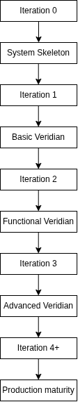

# Veridian

> A configurable personal workspace for organising information, workflows and productivity systems.

Veridian is a full-stack personal workspace designed to let users build their own organisational systems from a set of reusable, configurable components.

Rather than prescribing fixed application domains, Veridian provides a flexible structure of **categories, pages and components** that can be adapted to different workflows and use cases.

---

## Overview

The core Veridian model is:

```text
docs/roadmap.md
```

Users can create their own categories and pages, then populate pages with components such as lists, checklists, text, tables and other tools.

For example:

```text
University
├── Year 2
│   ├── Analysis
│   │   ├── Homework List
│   │   ├── Lecture Notes
│   │   └── Important Notes
│   └── Programming
│       ├── Coursework
│       └── Resources
└── Exam Revision
```

The same underlying system could also represent:

```text
Personal
├── Fitness
│   ├── Workout Tracker
│   └── Goals
├── Finance
│   └── Monthly budget
└── Recipes
    └── Meal Planner
```

Veridian does not fundamentally need to know that one page represents university work while another represents finances. They are both user-created workspace structures built from the same underlying system.

---

## Core Concepts

### Categories

Categories provide high-level organisation within a user's workspace.

Users can create and organise categories according to their own requirements.

### Pages

Pages provide individual workspaces within categories.

A page can contain multiple components and can be organised within the user's hierarchy.

### Components

Components are reusable building blocks that provide functionality within pages.

Potential component types include:

* Text
* Heading
* List
* Checklist
* Task
* Table
* Calendar
* Link
* Media

The component architecture is designed to allow additional component types to be introduced over time.

### Presets

Presets provide preconfigured starting points for common use cases.

Examples may include:

* University
* Shopping
* Entertainment
* Finance
* Project Management

Presets are built using the same categories, pages and components available to users.

For example:


After applying a preset, the generated objects become normal user-owned workspace objects that can be modified.

---

## Architecture

Veridian is structured as a full-stack application:


### Frontend

* React
* TypeScript
* Component-based UI
* Client-side application state
* Workspace management
* Dashboard
* Search
* Authentication
* Presets

### Backend

* Node.js
* TypeScript
* REST API
* Application services
* Validation and middleware
* Data access layer

The initial backend uses Node.js directly rather than introducing Express immediately, allowing the underlying HTTP architecture to be understood before higher-level abstractions are considered.

### Database

* PostgreSQL
* Relational data model
* Versioned migrations
* User ownership
* Workspace relationships
* Component data and configuration

---

## Project Structure

```text
Veridian/
├── Client/
│   ├── src/
│   │   ├── app/
│   │   ├── components/
│   │   ├── features/
│   │   ├── services/
│   │   └── types/
│   ├── public/
│   ├── package.json
│   └── tsconfig.json
├── Server/
│   ├── src/
│   │   ├── config/
│   │   ├── middleware/
│   │   ├── modules/
│   │   ├── routes/
│   │   ├── services/
│   │   ├── data/
│   │   └── server.ts
│   ├── tests/
│   ├── package.json
│   └── tsconfig.json
├── database/
│   ├── migrations/
│   ├── seeds/
├── docs/
│   ├── roadmap.md
│   ├── requirements.md
│   ├── architecture.md
│   ├── frontend.md
│   ├── api.md
│   ├── schema.md
│   ├── testing.md
│   ├── iterations/
│   └── diagrams/
├── .gitignore
├── README.md
├── LICENSE
└── package.json
```

---

## Development Approach

Veridian is being developed incrementally while maintaining the architecture of the complete application from the beginning.

The development process follows:



Each iteration advances the entire application rather than implementing isolated application domains.

### Iteration 0 — Foundation

Establish the complete technical foundation:

* React + TypeScript frontend
* Node.js + TypeScript backend
* PostgreSQL infrastructure
* API structure
* Database migration structure
* Testing framework
* Application architecture
* Documentation
* Basic health endpoint

The objective is to establish the skeleton of the complete system without implementing significant application functionality.

### Iteration 1 — Basic Veridian

Build the first usable end-to-end version.

Initial functionality includes:

* Categories
* Pages
* Basic components
* Lists
* Checklists
* Tasks
* Basic search
* Basic dashboard
* Registration and login
* User ownership
* Initial presets

### Iteration 2 — Functional Veridian

Develop the core systems into a properly functional and configurable workspace.

Planned areas include:

* Improved category/page management
* Component configuration
* Full list CRUD
* Component positioning
* Basic drag-and-drop
* Layout persistence
* Cross-workspace search
* Aggregated dashboard
* Persistent sessions
* Authorisation
* Expanded presets
* Integration and regression testing

### Iteration 3 — Advanced Veridian

Increase configurability and system maturity.

Planned areas include:

* Advanced workspace organisation
* Expanded component library
* Resizable components
* Advanced layouts
* Advanced search
* Customisable dashboard
* Stronger authentication and authorisation
* Custom presets
* Database optimisation
* Extensive testing

### Iteration 4+

Focus on production maturity:

* Performance optimisation
* Database optimisation
* Caching
* Security hardening
* Accessibility
* Responsive/mobile-first design
* Progressive Web App support
* Desktop packaging
* Deployment
* CI/CD
* Monitoring and logging
* Backup and recovery
* Automated testing

---

## API

Veridian exposes a REST-style API under:

```text
/api
```

Primary API groups include:

```text
api/
├── health
├── auth
├── categories
├── pages
├── components
├── presets
├── search
└── dashboard
```

The initial health endpoint is:

```http
GET /api/health
```

Response:

```json
{
    "status": "OK"
}
```

The API will expand alongside the application as functionality is introduced.

---

## Testing

Testing is treated as part of development rather than a final development stage.

Testing will progressively cover:

* Frontend components
* Backend logic
* API endpoints
* Database operations
* Authentication
* Integration between system layers
* End-to-end workflows
* Error and edge cases
* Performance
* Security

The testing strategy evolves alongside the application.

---

## Documentation

Project documentation is maintained in `docs/`.

```text
docs/
├── roadmap.md
├── requirements.md
├── architecture.md
├── frontend.md
├── api.md
├── schema.md
├── testing.md
├── iterations/
└── diagrams/
```

The documentation covers:

* Product requirements
* System architecture
* Frontend architecture
* API design
* Database schema
* Testing strategy
* Development iterations
* Architecture and data-flow diagrams

Architecture diagrams are maintained separately to provide visual representations of the system.

---

## Long-Term Direction

The long-term goal is to develop Veridian into a mature personal workspace that can adapt to different organisational requirements without requiring a separate application for each use case.

Potential future capabilities include:

* More advanced components
* Flexible page layouts
* Custom dashboards
* Advanced search
* Custom presets
* Progressive Web App support
* Desktop application packaging
* Mobile-oriented experiences
* Advanced automation
* AI-assisted functionality where appropriate

Future architecture changes will be driven by actual requirements, technical constraints and measured system behaviour rather than adding complexity prematurely.

---

## Status

**Current Stage:** Iteration 0 — Foundation / Skeleton

Veridian is currently under active development.

The current focus is establishing the complete application architecture and development infrastructure before implementing the first functional version.
