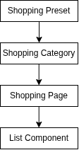
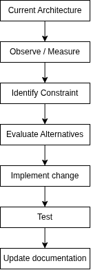

# Veridian — Development Roadmap

## 1. Overview

Veridian is a configurable personal workspace designed to allow users to create and organise their own information, workflows and productivity systems.

Rather than prescribing a fixed set of application domains, Veridian provides reusable building blocks that users can arrange according to their own requirements.

The fundamental structure is:

```text
User/
└── Categories/
    └── Pages/
        └── Components / Blocks
```

Users can create categories, organise pages within those categories and populate pages with configurable components.

Potential components may include:

* Lists
* Checklists
* Text
* Tables
* Tasks
* Calendars
* Links
* Media
* Other future component types

Common use cases such as shopping, university, school, finance or entertainment can be provided through presets.

Presets are preconfigured collections of the same components available to users rather than separate hard-coded application systems.

---

# 2. Development Philosophy

Veridian is developed through progressive iterations.

The complete system architecture is designed before implementation, while functionality is introduced incrementally.

Each iteration advances the entire application rather than assigning individual features to isolated iterations.


The system therefore remains a coherent application throughout development.

---

# 3. Core Product Model

The core Veridian model consists of four major concepts.

## Categories

Categories provide high-level organisation.

Examples:

```text
University
Shopping
Personal
Projects
Entertainment
```

Categories are created by the user and are not restricted to predefined purposes.

---

## Pages

Pages exist within categories and provide a workspace for the user.

Example:

```text
University/
├── Year 2
├── Analysis
├── Programming
└── Exam Revision
```

A page can contain multiple components.

---

## Components / Blocks

Components are reusable building blocks of Veridian.

A page may contain:

```text
Page/
├── Heading
├── Text
├── List
├── Checklist
├── Table
└── Calendar
```

Components can be configured and positioned by the user.

---

## Presets

Presets provide preconfigured starting points for common use cases.

Examples:

```text
Shopping Preset
University Preset
School Preset
Entertainment Preset
Finance Preset
Project Management Preset
```

A preset should create or configure standard Veridian objects rather than introduce a separate application subsystem.

For example:



The user can then modify the generated structure.

---

# 4. Iteration 0 — Foundation / Skeleton

## Objective

Establish the complete technical and architectural foundation of Veridian without implementing significant application functionality.

The goal is to prove that the major system layers can communicate correctly.

### Frontend

* React + TypeScript application
* Basic application entry point
* Routing structure
* Application layout
* Placeholder structures for:

  * Dashboard
  * Search
  * Authentication
  * Categories
  * Pages
  * Components
  * Presets
* Initial shared component architecture

### Backend

* Node.js + TypeScript
* Basic HTTP server
* API routing structure
* Configuration structure
* Error-handling structure
* Health endpoint

```http
GET /api/health
```

Response:

```json
{
    "status": "OK"
}
```

### Database

* PostgreSQL environment established
* Database configuration
* Connection infrastructure
* Migration structure
* Initial conceptual schema

No significant application data needs to be implemented.

### Testing

* Testing framework configured
* Basic environment test
* Health endpoint test

### Documentation

* Requirements
* Architecture
* API design
* Database schema
* Frontend architecture
* Testing strategy
* Iteration documentation

---

# 5. Iteration 1 — Basic Veridian

## Objective

Create the first usable end-to-end version of the configurable Veridian platform.

The user should be able to create a basic organisational structure and populate pages with basic components.

### Workspace

* Create categories
* View categories
* Create pages
* View pages
* Organise pages within categories

### Components

Introduce the first basic component types.

Potential examples:

* Text
* List
* Checklist
* Basic task component

Users should be able to:

* Add components to a page
* View components
* Edit basic component content
* Remove components

### Lists

Lists exist as a reusable component rather than a separate application domain.

Basic functionality:

* Create list
* Add list items
* View list
* Complete list items

### Search

* Basic keyword search
* Search across available user-created content

### Dashboard

* Basic dashboard
* Display a summary of the user's workspace
* Show basic pages, lists or tasks

### Authentication

* Registration
* Login
* Logout
* Basic user ownership

### Presets

The initial preset mechanism may be introduced once the underlying component system is available.

Potential initial presets:

* Shopping
* University / School
* Entertainment

Presets should generate standard Veridian structures that users can modify.

### Testing

* Basic frontend tests
* Basic backend tests
* API tests
* Authentication tests
* Database tests
* Basic component tests

---

# 6. Iteration 2 — Functional Veridian

## Objective

Transform the basic workspace into a properly functional and configurable system.

### Workspace

* Improved category management
* Improved page management
* Nested organisation where appropriate
* Page editing
* Page deletion
* Improved organisation and navigation

### Components

* More component types
* Component editing
* Component deletion
* Component configuration
* Component positioning
* Improved reusable component architecture

### Lists

* Full CRUD
* Edit lists
* Delete lists
* Edit/delete items
* Completion state
* Sorting
* Filtering

### Layout

* Move components around pages
* Basic drag-and-drop positioning
* Improved page layouts
* Component sizing/configuration where appropriate

### Search

* Cross-page search
* Search across multiple component types
* Filtering
* Sorting

### Dashboard

* Aggregated workspace information
* Recently modified content
* Outstanding tasks
* Relevant page information
* Improved navigation

### Authentication

* Persistent sessions
* Protected routes
* User-specific data
* Password validation
* Authorisation

### Presets

* Expanded preset system
* Preset configuration
* Ability to customise generated structures
* Additional common-use presets

### Testing

* Unit tests
* API tests
* Database tests
* Integration tests
* Authentication tests
* Invalid input testing
* Missing resource testing
* Edge-case testing
* Regression testing

---

# 7. Iteration 3 — Advanced Veridian

## Objective

Develop Veridian into a highly configurable personal workspace with stronger cross-system functionality.

### Workspace

* Advanced category/page organisation
* Nested structures
* Improved navigation
* More flexible page layouts
* Advanced page configuration

### Components

* Expanded component library
* Advanced configuration
* Component-specific settings
* Reusable component patterns
* More sophisticated interactions

### Layout

* Advanced drag-and-drop
* Flexible positioning
* Resizing
* Layout persistence
* Improved visual customisation

### Search

* Advanced cross-workspace search
* Search across relationships
* Advanced filtering
* Improved ranking
* Query optimisation

### Dashboard

* Customisable dashboard
* Configurable widgets/components
* Cross-workspace aggregation
* Personalised information views

### Authentication

* Stronger session management
* More detailed authorisation
* Improved security controls
* Account management

### Presets

* More sophisticated presets
* Custom preset creation
* Preset modification
* Preset sharing/importing where appropriate

### Backend

* More sophisticated application services
* Improved validation
* Improved error handling
* Stronger separation of responsibilities

### Database

* More complex relationships
* Indexing
* Query optimisation
* Additional constraints
* Improved data integrity

### Testing

* Extensive unit testing
* Integration testing
* API testing
* End-to-end testing
* Performance testing
* Security-focused testing

---

# 8. Iteration 4+ — Production Maturity

Later iterations focus increasingly on reliability, scalability, performance and deployment.

Potential areas include:

* Performance optimisation
* Database optimisation
* Advanced caching
* Production authentication/security
* Accessibility
* Responsive/mobile-first design
* Progressive Web App functionality
* Desktop packaging
* Deployment
* CI/CD
* Monitoring
* Logging
* Backup/recovery
* Automated testing pipelines
* Advanced workspace functionality
* Advanced preset systems

The exact scope of later iterations should be determined by requirements and constraints discovered during development.

---

# 9. Development Matrix

| System         | I0             | I1              | I2                   | I3           | I4+        |
| -------------- | -------------- | --------------- | -------------------- | ------------ | ---------- |
| Frontend       | Skeleton       | Basic           | Functional           | Advanced     | Production |
| Backend        | Skeleton       | Basic           | Structured           | Advanced     | Production |
| Database       | Infrastructure | Core schema     | Relationships        | Optimised    | Production |
| Categories     | Placeholder    | Basic           | Functional           | Advanced     | Production |
| Pages          | Placeholder    | Basic           | Functional           | Advanced     | Production |
| Components     | Placeholder    | Basic           | Configurable         | Advanced     | Production |
| Lists          | Placeholder    | Basic component | Full functionality   | Advanced     | Production |
| Search         | Placeholder    | Basic           | Cross-workspace      | Advanced     | Optimised  |
| Dashboard      | Placeholder    | Basic           | Aggregated           | Customised   | Advanced   |
| Authentication | Placeholder    | Basic auth      | User ownership       | Secure       | Production |
| Presets        | Placeholder    | Initial         | Expanded             | Customisable | Advanced   |
| Testing        | Framework      | Basic           | Unit/API/Integration | Extensive    | Full       |

---

# 10. Definition of Iteration Completion

An iteration is considered complete when the planned changes across the system have been:

1. Implemented
2. Tested
3. Integrated
4. Documented
5. Reviewed against requirements
6. Demonstrated as a coherent application

Each iteration should produce a working version of Veridian rather than an isolated collection of completed features.

---

# 11. Architecture Evolution

Architecture should evolve based on observed requirements and technical constraints.



Complexity should be introduced when it provides a clear engineering benefit.
